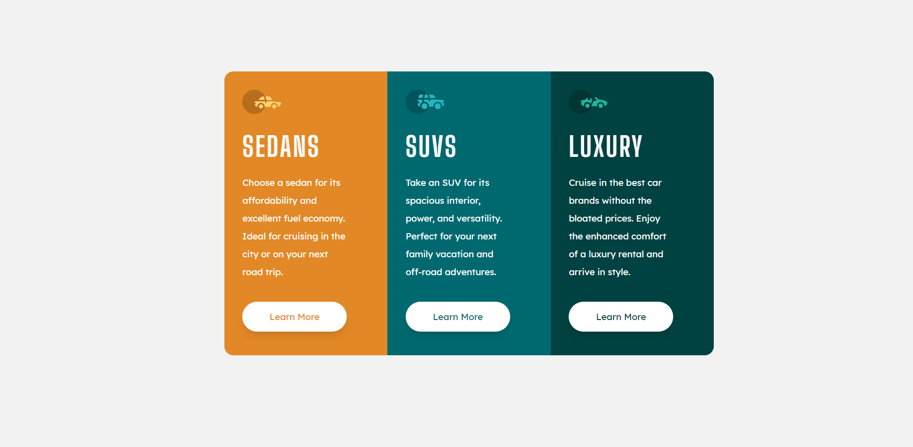

# Frontend Mentor - 3-column preview card component

## The challenge

Your challenge is to build out this 3-column preview card component and get it looking as close to the design as possible.

You can use any tools you like to help you complete the challenge. So if you've got something you'd like to practice, feel free to give it a go.

# Frontend Mentor - 3-column preview card component solution

This is a solution to the [3-column preview card component challenge on Frontend Mentor](https://www.frontendmentor.io/challenges/3column-preview-card-component-pH92eAR2-). Frontend Mentor challenges help you improve your coding skills by building realistic projects. 

## Table of contents

- [Overview](#overview)
  - [The challenge](#the-challenge)
  - [Screenshot](#screenshot)
  - [Links](#links)
- [My process](#my-process)
  - [Built with](#built-with)
  - [What I learned](#what-i-learned)
  - [Continued development](#continued-development)
  - [Useful resources](#useful-resources)
- [Author](#author)

## Overview

### The challenge

Users should be able to:

- View the optimal layout depending on their device's screen size
- See hover states for interactive elements

### Screenshot

### Links

- Solution URL: [Add solution URL here](https://github.com/hongleang/preview-card-component-main)
- Live Site URL: [Add live site URL here](https://hongleang.github.io/preview-card-component-main/)

## My process

### Built with

- Semantic HTML5 markup
- Css BEM
- CSS custom properties
- Flexbox
- Mobile-first workflow
- Scss

### What I learned
- CSS variables
- Border-box: box-sizing and padding behaviour
- CSS BEM naming convention
- SASS folder structure

### Continued development

- Responsive to smaller size mobile screen
- Responsive to small tablet size

### Useful resources

- [resource 1](https://matthewelsom.com/blog/simple-scss-playbook.html) - This helped me in structuring my SASS model. I really liked this pattern and will use it going forward.

## Author

- Website - [Hongleang Lim]

